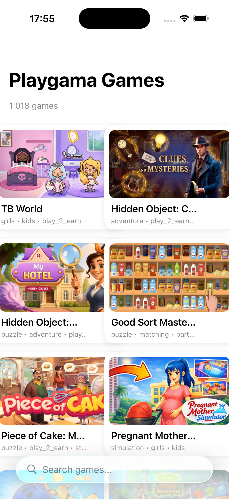
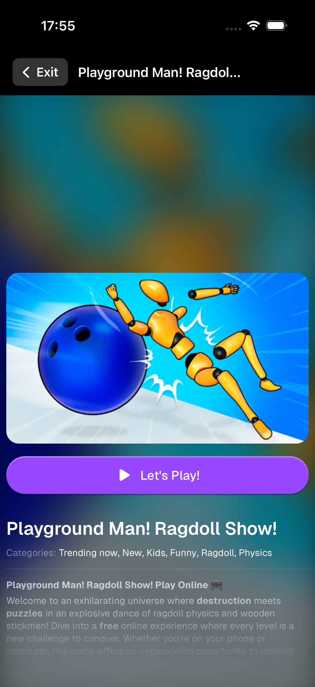
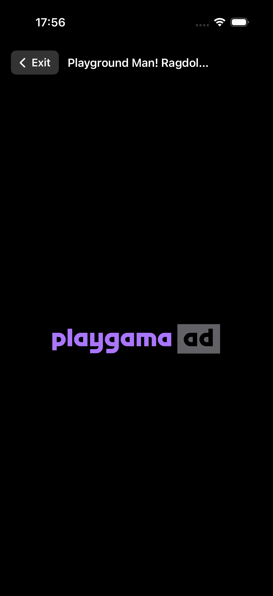
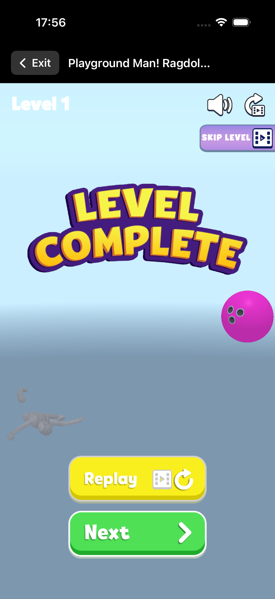
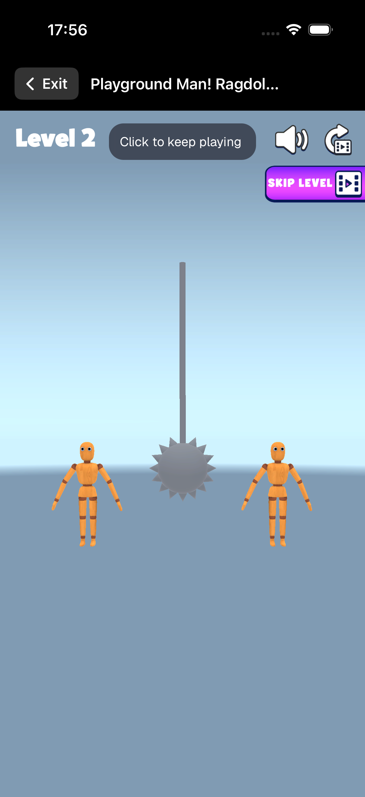

# Playgama Games — Mobile SDK Integration

Examples of integrating the [Playgama](https://playgama.com) game catalog into iOS and Android mobile apps.

## ⚠️ Important: Download Your Own Game Catalog!

**The `games.json` file in this repository is for demonstration only!**

To earn revenue from ads, download the catalog with your CLID:

### 📥 How to Get the Catalog

1. Go to [widgets.playgama.com](https://widgets.playgama.com)
2. Sign up or log in to your account
3. Select the games you want or download the entire catalog
4. Click **Download JSON**

### 🔑 What is CLID?

The downloaded catalog contains your unique identifier in each game:

```json
{
  "gameURL": "https://playgama.com/export/game/puzzle?clid=p_YOUR_UNIQUE_ID"
}
```

**CLID is required for:**
- 💰 Calculating your ad revenue
- 📊 Tracking statistics
- 💵 Receiving payouts in the partner program

⚠️ **Without CLID, ad revenue will not be credited to your account!**

---

## 📁 Project Structure

```
sdk-embed/
├── README.md           # This file
├── games.json          # Sample catalog (replace with yours!)
│
├── ios/                # 🍎 iOS (Swift/SwiftUI)
│   ├── README.md       # iOS instructions
│   ├── PlaygamaGames.xcodeproj/
│   └── PlaygamaGames/
│       ├── Models/
│       ├── Services/
│       └── Views/
│
└── android/            # 🤖 Android (Kotlin)
    ├── README.md       # Android instructions
    └── app/
        └── src/main/
            ├── assets/games.json
            ├── java/.../
            └── res/
```

---

## 📱 Screenshots

<p align="center">
  
  
  
  
  
</p>

---

## 🚀 Quick Start

### iOS

1. Open `ios/PlaygamaGames.xcodeproj` in Xcode
2. Replace `games.json` with your own (containing your CLID)
3. Select a simulator → Run ▶️

Details: [ios/README.md](ios/README.md)

### Android

1. Open the `android/` folder in Android Studio
2. Replace `app/src/main/assets/games.json` with your own
3. Sync Gradle → Run ▶️

Details: [android/README.md](android/README.md)

---

## 🎮 How It Works

```
┌─────────────────┐     ┌──────────────────┐     ┌─────────────────┐
│   games.json    │────▶│    Your App      │────▶│    WebView      │
│   (catalog)     │     │   (native UI)    │     │  (game launch)  │
└─────────────────┘     └──────────────────┘     └─────────────────┘
                                                         │
                                                         ▼
                                                ┌─────────────────┐
                                                │    Playgama     │
                                                │   (ads →        │
                                                │  your revenue)  │
                                                └─────────────────┘
```

1. **Catalog** (`games.json`) — list of games with metadata and URLs
2. **Native UI** — your app displays the game list
3. **WebView** — selected game opens in WebView
4. **Ads** — games show ads, revenue goes to you (via CLID)

---

## 📞 Support

- Documentation: [wiki.playgama.com](https://wiki.playgama.com/playgama/for-partners/import-the-game-catalog)
- Email: partners@playgama.com

---

## 📄 License

Code examples are provided as-is for integrating Playgama games.
